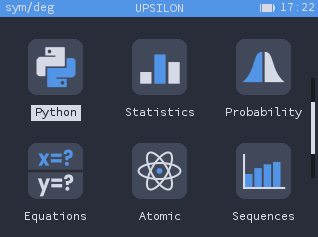

# Omega Arc Dark theme
Contains source SVGs for app icons

### Screenshots



### Installation
To use this theme, add `THEME_NAME` and `THEME_REPO` arguments to your `make` command:
```bash
$ make THEME_NAME=arc_dark THEME_REPO="https://github.com/lolocomotive/Omega-Arc-Dark"
```
_Notice: I made some tweaks to the operating system itself to be able to modify certain colors, if you want to be sure that it works, clone [my Upsilon fork](https://github.com/lolocomotive/Upsilon) instead of any other operating system._

### Author / Source
Theme made by [@lolocomative](https://github.com/lolocomotive)
<br>
**original repo** : https://github.com/lolocomotive/Omega-Arc-Dark

### Licence
This theme is released under a [CC BY-NC-SA License](https://creativecommons.org/licenses/by-nc-sa/4.0/legalcode).
