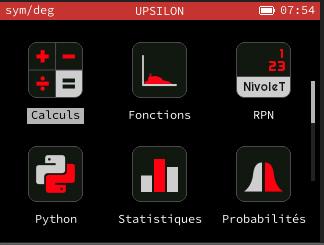

# FC-Nivolet
A theme for the FC-Nivolet suporters.

### Screenshots



### Installation
To use this theme, add `THEME_NAME` and `THEME_REPO` arguments to your `make` command:
```bash
$ make THEME_NAME=fc-nivolet_dark THEME_REPO="https://github.com/hugo-b-r/Upsilon-Themes"
```

### Author / Source
Made by: [@hugo-b-r](https://github.com/hugo-b-r)
<br>
**original repo** : https://github.com/hugo-b-r/Upsilon-Themes

### Licence
This theme is released under a [MIT licence](https://choosealicense.com/licenses/mit/)
