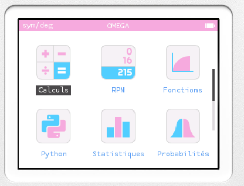
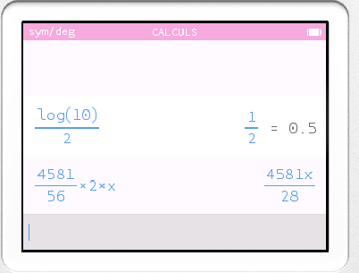
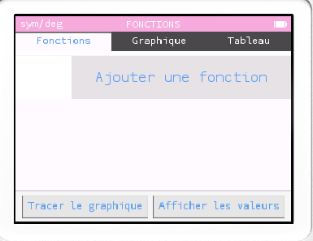
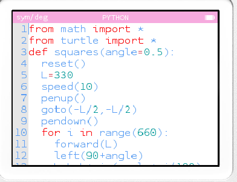

# Omega-LGBT theme for Omega
A theme for LGBTQ+

### Screenshots







### Installation
To use this theme, add `THEME_NAME` and `THEME_REPO` arguments to your `make` command:
```bash
$ make THEME_NAME=omega_trans THEME_REPO="https://github.com/coco33920/Omega-LGBT"
```

### Author / Source
Theme made by [@coco33920](https://github.com/coco33920)
<br>
**original repo** : https://github.com/coco33920/Omega-LGBT

### Licence
This theme is released under a [CC BY-NC-SA License](https://creativecommons.org/licenses/by-nc-sa/4.0/legalcode).
